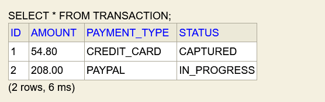
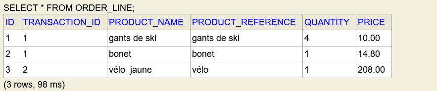

Java version
17

This it a Spring Boot application using Spring WebFlux and R2DBC

Database configuration
the application use a H2 database in memory 
the connection info are in the application.yml
I let the H2 console activate for testing purpose

I use a liquibase script to create the table it is located in the resources/db/changelog/db.changelog-master.yaml

I use R2DBC to have a reactive connection to the database

picture of the H2 console for Transaction table

picture of the H2 console for OrderLine table
